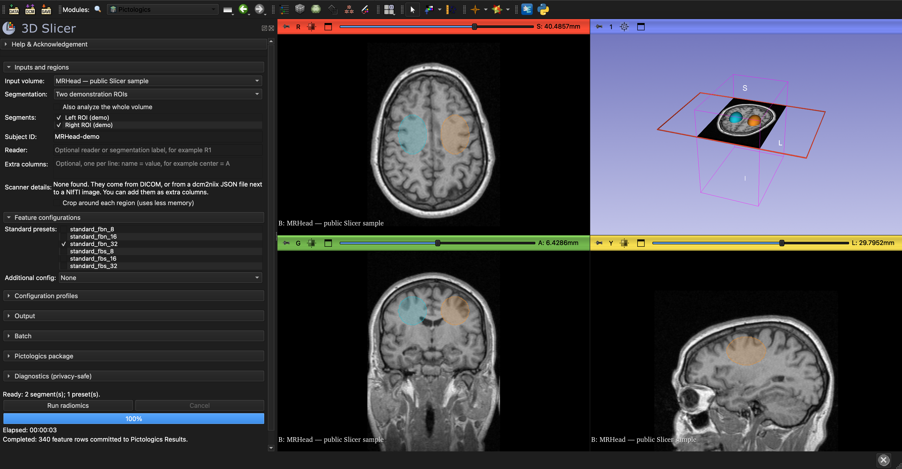
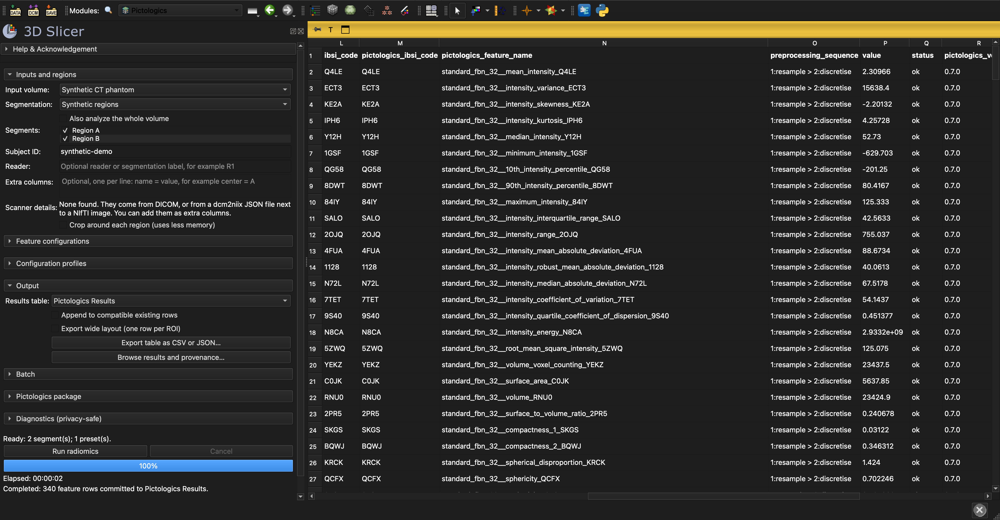

# Pictologics for 3D Slicer

[](https://github.com/martonkolossvary/SlicerPictologics/actions/workflows/ci.yml)
[](https://codecov.io/gh/martonkolossvary/SlicerPictologics)

Pictologics for 3D Slicer extracts radiomics features: quantitative measurements of
image intensity, shape, and texture from 3D images and segmented regions. It uses the
IBSI-compliant [Pictologics](https://github.com/martonkolossvary/pictologics) package.
The module is **Pictologics** in Slicer's **Informatics** category.

The extension provides:

- one 3D scalar-volume input;
- any number of independently processed segments from one segmentation, plus an
  optional whole-volume region;
- the six Pictologics standard presets, an in-app single-configuration builder
  (feature families, resampling, intensity-range resegmentation, outlier filtering,
  discretisation, and voxel-validity/sentinel mode),
  and optional custom YAML/JSON configuration with authoring aids;
- named settings profiles with save, load, and save-copy actions;
- background execution in a separate worker process, progress, and cancellation;
- atomic long-form results in a `vtkMRMLTableNode`, with replace or append behavior;
- a read-only results browser with feature search, ROI/configuration/family/status
  filters, and readable feature details and per-run provenance;
- a scripting method that runs many cases, one after the other, into one table;
- CSV export with a provenance sidecar, or a self-contained JSON export, with
  per-run provenance retained when tables are appended; and
- installation of Pictologics and its dependencies into a private folder, after you
  approve it.

This is research software. It is not a medical device and must not be used for
clinical diagnosis or treatment decisions.

## Screenshots



Workflow: Slicer's public **MRHead MRI** with two illustrative, non-clinical masks.
Both segments were analyzed: **170 features per segment, 340 total**.



Results-table example: a separate run on the earlier **synthetic CT-like phantom**,
not the MRHead run above. Both examples are genuine Slicer captures using
Pictologics 0.5.1 and `standard_fbn_32`.
See [sample attribution, capture provenance, and reproduction](docs/screenshots/README.md).

## Modules

- **Pictologics** (Informatics): the user interface. It selects the scan and the
  regions, sets up the feature settings, starts and stops runs, and shows, browses,
  and exports the results.
- **Pictologics Worker (internal)** (Informatics): runs the extraction in a separate
  background process. You do not need to open this module.

## Install

The extension needs **3D Slicer 5.12** or later.

### Extensions Manager

[`Pictologics.json`](Pictologics.json) is a Tier-1 ExtensionsIndex draft. Until it has
been submitted, accepted, and built by the Slicer extension factory, load the source
code as the [developer guide](docs/development.md#load-a-development-checkout)
describes. Once published, use **View → Extensions Manager**, search for Pictologics,
install it, and restart Slicer.

### First run

The first run needs an internet connection. The module asks before it installs
Pictologics and its dependencies (about 500 MB) into a private folder. It installs the
dependency versions that were tested with the adopted Pictologics release. Slicer's
own Python packages do not change. After a newer Pictologics version is installed, the
old version is deleted automatically.

## Use

1. Load a 3D scalar volume and, for region-based extraction, a segmentation.
2. Open **Pictologics**, choose the volume, check one or more segments, and decide
   whether to include the whole volume. Overlapping segments remain independent.
   Whole-volume analysis is off by default: the presets resample the entire scan,
   which can need several gigabytes of memory for a large CT.
3. Check one or more standard presets and/or add one more configuration via
   **Additional config**: *Build one in app* (choose feature families, resampling,
   optional ROI refinement, discretisation, and voxel-validity/sentinel mode) or *Load from file* (browse to a
   custom Pictologics YAML/JSON, generate a starter with **New from preset…**, or press
   **Validate** to load the file with Pictologics as a run does).
4. Choose or create an output table. Check the **Ready** summary of whole-volume,
   segment, and configuration selections, then select **Run radiomics**. Readiness
   checks the controls; geometry and custom configurations are checked again during
   preparation and worker execution. If one copy of the resampled scan needs more
   than about 1 GB of memory, the module asks before it starts.
5. On first use, review and approve installation into the private dependency target.
   No global Slicer package is replaced. The first run is slower because of JIT warmup.
6. Follow the current phase and **Processing ROI _n_ of _total_: _name_** message.
   **Elapsed** includes dependency checks, input preparation, and extraction; it is
   not an estimate of time remaining and stops at completion, failure, or cancellation.
   Multi-ROI percentages indicate completed regions, not estimated computation time.
   A single ROI uses an animated busy indicator. Use **Cancel** to stop the background
   job. Cancellation or fatal failure preserves
   the previous table; completed results are committed to the scene together.
7. Select **Export table as CSV or JSON…** to save the current results table. Enable
   **Export wide layout** for one row per ROI with Pictologics' exact
   `config__feature_key` columns instead of the default long layout. JSON
   includes the complete per-run provenance
   history and feature data dictionary; CSV writes companion `.provenance.json` and
   `_catalog.csv` files (the latter is the Slicer-side equivalent of Pictologics'
   `describe_features()`). For example, `features.csv` gets `features_catalog.csv`,
   the name that eigenradiomics finds automatically.

The long table keeps the official `ibsi_code` and also reports the exact native
`feature_key`, Pictologics' disambiguated `pictologics_ibsi_code`, the package-wide
`pictologics_feature_name`, and `preprocessing_sequence`. For example, the official
IBSI code `BC2M` is paired with `BC2M_10` or `BC2M_90`, and a package-wide name such as
`standard_fbn_32__volume_at_intensity_fraction_0.10_BC2M_10`. The longer identifier is
Pictologics-specific, not a second official IBSI code. Complete preprocessing
parameters remain in the feature data dictionary.

The columns `config`, `family`, `feature_name`, `feature_key`, `ibsi_code`, and
`preprocessing_sequence` mean the same as in Pictologics' `describe_features()`:
`feature_key` is the full key with the IBSI code (`mean_intensity_Q4LE`), and
`feature_name` is the name without the code (`mean_intensity`). These columns form
result format 2 of the extension's initial `0.1.0` release. Tables in format 1, from
earlier development versions, cannot be appended, browsed, or exported; run the
extraction again.

One results column keeps one meaning. If you append a run to a table that already
holds a configuration of the same name with other settings, the new results go to a
new table, and the status line names the configuration. For example, the in-app
configuration is always named `in_app`, so changed in-app settings start a new table.

### Refine ROIs without editing a configuration file

Choose **Additional config → Build one in app**. Two optional, initially disabled
steps refine the calculation masks without modifying the input image or segmentation:

- **Intensity-range resegmentation:** enter an inclusive minimum and/or maximum
  in the image's intensity units (not necessarily HU). A blank bound is unlimited;
  at least one bound is required when enabled. Invalid numbers and reversed bounds
  block Run with an explanation in the readiness label.
- **Outlier filtering:** retain values within the current ROI mean ± sigma times
  its population standard deviation. Sigma must be positive; the editor supports
  0.001–1000 with three-decimal precision. The default is 3, but the step remains
  disabled until explicitly enabled.

Each step has an independent **Apply to** choice:

- **Both masks (changes shape):** refine intensity and morphology masks, matching
  Pictologics' default behavior for these steps.
- **Intensity only (preserves shape):** refine the intensity mask while keeping
  the morphology mask unchanged by this step.
- **Morphology only:** refine the morphology mask without changing intensity-mask
  membership. Outlier statistics are computed separately for each targeted mask.

The fixed order is **resample → intensity range → outliers → discretise → features**;
disabled steps are skipped. These controls affect only `in_app`, not the checked
standard presets. ROI refinement removes voxels from calculation masks; it does
not clip or overwrite image intensities. If a required mask becomes empty, the
worker reports the ROI error instead of falling back to the original mask.
Effective steps, mask targets, and parameters are retained in result provenance.

### Browse results and provenance

Select **Browse results and provenance…** in the Output section to open a resizable,
read-only results window. Search by feature name, IBSI code, native feature key, or
preprocessing text; combine ROI, configuration, family, and status filters. ROI
choices are scoped to a run, so appended runs with identical segment names remain
distinct. Large result sets are paged in groups of 200 rows.

Select a row to inspect its value, both IBSI identifiers, software versions, exact
run/configuration, configuration hash, preprocessing parameters, processing errors,
and feature-dictionary metadata. Requested/effective filter parameters appear when
present in the recorded processing log. Missing provenance is reported explicitly.

The browser is a **snapshot**: use **Refresh selected table** after a new run or
changing the output table. Filters never change the MRML table or export behavior:
**Export table as CSV or JSON… still exports the complete selected table**, not just
the visible matches. Closing the scene clears the browser's snapshot.

### Save and reuse configuration profiles

In **Configuration profiles**, use **Save…** to name and save the checked standard
presets and optional in-app configuration to a `.pictologics-profile.json` file.
Use **Load…** to restore them, or **Save copy…** to save the current settings under a
new name/file without replacing the original. Save again after editing settings;
changes are not automatically written back to the profile file.
Profiles include the optional ROI-refinement controls. Original version-1 profiles
without these fields still load with both refinement steps disabled, preserving
their previous behavior. Newly saved profiles with these fields require this newer
extension code; older versions reject them rather than silently ignoring settings.

Profiles do not capture image/segmentation selections, subject IDs, output tables,
or machine-specific dependency paths. Loading validates all settings before changing
the controls and rejects unsupported values instead of silently clamping them.
Profile names label saved settings; native configuration names (`in_app` and the
standard preset names) and exported feature names are unchanged.
Profiles do not pin a package version: each run uses the extension's adopted
Pictologics release and records its version and effective configuration in provenance.

These are **Slicer settings files**, not native Pictologics pipeline configuration
files. Advanced YAML/JSON pipelines still use **Additional config → Load from file**;
profile saving is disabled in that mode. A profile can select multiple standard
presets and one in-app configuration, not multiple custom pipelines.

### Process many cases with a script

Use Slicer's Python console (**View → Python Console**) to run many cases into one
table. Change the folder and the file names to match your data.

```python
from pathlib import Path

logic = slicer.util.getModuleLogic("PictologicsSlicer")
study = Path("/path/to/study")
table = None
for case in sorted(path for path in study.iterdir() if path.is_dir()):
    volume = slicer.util.loadVolume(str(case / "image.nii.gz"))
    segmentation = slicer.util.loadSegmentation(str(case / "segmentation.seg.nrrd"))
    table = logic.process(volume, segmentation, subjectID=case.name, outputTable=table)
    slicer.mrmlScene.RemoveNode(volume)
    slicer.mrmlScene.RemoveNode(segmentation)
logic.exportTable(table, study / "features.csv", wide=True)
```

- `logic.process` returns when the case is complete. Slicer does not respond during
  a case.
- All segments are regions by default. Use `segmentIDs=[...]` to select segments, and
  `includeWholeVolume=True` to add the whole scan.
- Use `standardConfigurations=[...]` to select presets, and
  `customConfigurationPath="settings.yaml"` to add a configuration file.
- A region that fails gets rows with a status that is not `ok`, and the loop
  continues. A case that cannot run stops the loop with an error.
- `wide=True` writes one row per region. The export also writes
  `features_catalog.csv`, so the files are ready for eigenradiomics (see below).

### Analyze the results with eigenradiomics

[eigenradiomics](https://github.com/martonkolossvary/eigenradiomics) reads the wide CSV
export and its catalog. Name the export `features.csv`, so that the catalog is
`features_catalog.csv`, which eigenradiomics finds automatically.

```python
from eigenradiomics import RadiomicsDataset

dataset = RadiomicsDataset.from_pictologics(
    "features.csv", drop_subject_id=False, group="subject_id"
)
```

`drop_subject_id=False` keeps the extension's `subject_id` column, which the loader
otherwise deletes. The feature columns have the same names as in Pictologics' own wide
output.

## Current limitations

- One scalar 3D volume is processed per run; vector and 4D images are out of scope.
  To process many cases, use a script (see above).
- The extension accepts segmentation regions and whole-volume mode, not multi-label
  labelmap selection.
- Nonlinear parent transforms are rejected. Resample with an explicit interpolation
  choice before running. Linear transforms are hardened into temporary geometry.
- Cancellation is at the CLI-process/job boundary. The current Pictologics 0.5.1 API
  has no cooperative progress/cancellation callback, so a running native kernel cannot
  report fine-grained progress. Multi-ROI jobs report completed-ROI percentages;
  single-ROI jobs display an indeterminate busy indicator until the package returns.
- The in-app builder composes a single configuration with a fixed step order
  (families, resample, resegment, filter outliers, discretise, source mode).
  Further advanced steps (IBSI-2 image filters, custom discretisation cut-offs, mask
  binarization, and largest-component selection), or a different step order, still
  require a custom YAML/JSON file. Before Pictologics is installed, **Validate** does
  only a quick structural check.
- Pictologics resamples the whole scan for each region, not only the area around it.
  Large scans with fine resampling spacing can therefore need several gigabytes of
  memory.
- Each configuration is computed on its own, because Pictologics 0.5.1 can copy wrong
  values between configurations when it reuses shared results. Runs with several
  presets therefore take longer.
- The long table adds provenance columns (run, ROI, status, and versions) to the
  Pictologics names. The long `format_results` layout of Pictologics 0.5.1 still
  calls the full key `feature_name`; a planned Pictologics release renames it to
  `feature_key`, so that all names agree. Wide feature names match Pictologics
  exactly.

## For developers

The [developer guide](docs/development.md) describes the design, the private
dependency folder, testing, packaging, and the release process. The
[release-readiness review](docs/release-readiness.md) records the validation evidence.

## License

SlicerPictologics is licensed under the Apache License 2.0. See [LICENSE](LICENSE) and
[NOTICE](NOTICE).

## References

- [3D Slicer extension user guide](https://slicer.readthedocs.io/en/latest/user_guide/extensions.html)
- [3D Slicer extension developer guide](https://slicer.readthedocs.io/en/latest/developer_guide/extensions.html)
- [Slicer ExtensionsIndex](https://github.com/Slicer/ExtensionsIndex)
- [SlicerRadiomics reference extension](https://github.com/AIM-Harvard/SlicerRadiomics)
